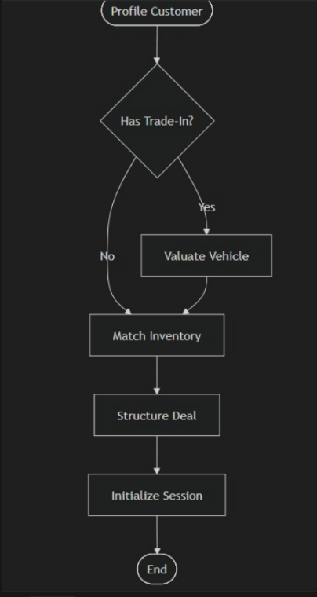

# 🚗 Drive Expert (Backend)

> **Plateforme Agentique de Négociation & Gestion de Flotte (Sogetrel / Auto-UC2)**

Bienvenue sur le backend de **Drive Expert**. Cette API RESTful robuste propulse la plateforme de reprise de véhicules, de vente et de gestion de contrats. Elle est conçue pour être consommée par un Frontend (React/Mobile) et par des **Agents IA** (Python/GROQ).

---

## 🏗️ Architecture & Stack Technologique

Le projet suit une architecture **MVC (Model-View-Controller)** stricte et modulaire.

- **Runtime** : Node.js (v18+)
- **Framework** : Express.js
- **Database** : MongoDB Atlas (Mongoose ODM)
- **Real-Time** : Socket.io (Websockets)
- **Storage** : Cloudinary (Images & PDFs)
- **Security** : JWT, Helmet, RateLimit, HPP, xss-clean
- **Documentation** : Swagger UI (`/api-docs`)

---

## 👥 Hiérarchie des Rôles & Permissions

Le système implémente **6 niveaux de rôles** avec des permissions granulaires :

```
┌─────────────────────────────────────────┐
│         SUPERADMIN (Système)            │
│  ✓ Tous les endpoints                   │
│  ✓ Backups & Restauration               │
│  ✓ Audit de sécurité                    │
└─────────────────────────────────────────┘
                  ↓
┌─────────────────────────────────────────┐
│      ADMIN (Multi-Agences)              │
│  ✓ Gestion des agences                  │
│  ✓ Gestion des utilisateurs             │
│  ✓ Impersonation                        │
│  ✓ Métriques système                    │
└─────────────────────────────────────────┘
                  ↓
┌─────────────────────────────────────────┐
│     MANAGER (Une Agence)                │
│  ✓ Gestion employés de son agence       │
│  ✓ Analytics agence                     │
│  ✓ Vue véhicules/clients agence         │
│  ✗ Pas d'accès autres agences           │
└─────────────────────────────────────────┘
                  ↓
┌─────────────────────────────────────────┐
│   USER/COMMERCIAL (Employé Agence)      │
│  ✓ Gestion véhicules                    │
│  ✓ Négociations                         │
│  ✓ Gestion clients assignés             │
│  ✗ Limité à son périmètre               │
└─────────────────────────────────────────┘
                  ↓
┌─────────────────────────────────────────┐
│          CLIENT (End-User)              │
│  ✓ Profil & préférences                │
│  ✓ Rendez-vous                          │
│  ✓ Négociations personnelles            │
└─────────────────────────────────────────┘
                  ↓
┌─────────────────────────────────────────┐
│         GUEST (Non-Authentifié)         │
│  ✓ Browse véhicules                     │
│  ✓ Géolocalisation agences              │
│  ✗ Pas d'actions sensibles              │
└─────────────────────────────────────────┘
```

**📖 Documentation complète** : Voir [MANAGER_API.md](./docs/MANAGER_API.md)

---

## 📦 Catalogue des Services

L'application est divisée en micro-modules logiques. Voici ce que vous pouvez faire :

### 1. 🛡️ Authentification & Security Core

_Gestion des identités et de la sécurité._

- **Auth** : `POST /register`, `/login`, `/logout`, `/refresh`.
- **MFA (2FA)** : Protection via authentificateur (Google Auth) pour les comptes sensibles.
- **Impersonation** : (`/admin/users/:id/impersonate`) Permet aux admins de se connecter "en tant que" client pour le support.
- **Privacy & GDPR** : (`PUT /my/consents`) Gestion fine des autorisations (Marketing, Data).

### 2. 🚛 Commercial & Fleet Management

_Cœur métier pour les Commerciaux et Managers._

- **Vehicles** : CRUD complet des véhicules. Upload photos via Cloudinary.
- **Negotiations** : Moteur de négociation (Offre -> Contre-offre -> Acceptation).
- **Client CRM** : Gestion des profils clients, notes et historique.
- **Dashboard** : KPIs temps réel pour le pilotage.

### 3. 👤 Client Experience (End-User)

_Services destinés à l'application mobile/web client._

- **Appointments** : (`/my/appointments`) Prise de rendez-vous (Essai, Livraison).
- **Geolocation** : (`/public/agencies-within/...`) Recherche d'agences Sogetrel par rayon (GeoJSON).
- **Notifications** : Système hybride (Push WebSocket + Historique Pull).

### 4. 📄 Documents & Contrats

_Légalisation des accords._

- **PDF Generator** : (`/contracts/generate`) Création automatique de contrats au design "Drive Expert".
- **E-Signature** : (`/contracts/:id/sign`) Signature numérique avec horodatage et IP.

---

## 🤖 Intégration Agentique (Pour l'équipe Python/GROQ)

Ce backend est "Agent-Ready". Vos scripts Python peuvent interagir avec l'API pour automatiser la négociation.

### 🧠 Workflow de l'Agent

L'agent doit suivre le flux logique suivant pour mener une négociation à bien :



1.  **Profilage** : Récupérer les données du client (`GET /api/v1/clients/:id`).
2.  **Trade-In (Reprise)** :
    - Si OUI : Lancer une valuation (`GET /vehicles/:id/valuation`).
    - Si NON : Passer au matching.
3.  **Match Inventory** : Chercher un véhicule dans le catalogue (`GET /public/browse`).
4.  **Structure Deal** : Créer une nouvelle négociation formelle (`POST /negotiations`).
5.  **Initialize Session** : Démarrer l'échange temps réel via WebSocket pour discuter.

### 🔌 Guide de Connexion (Python)

L'agent doit agir comme un **utilisateur privilégié** (Service Account).

**1. Authentification**
Récupérez un Token JWT Bearer.

```python
import requests

API_URL = "http://localhost:4000/api/v1"

# Login de l'Agent
payload = {
    "email": "ai-agent@drive-expert.com",
    "password": "SECURE_PASSWORD_123"
}
response = requests.post(f"{API_URL}/auth/login", json=payload)
token = response.json()['token']

print(f"🔑 Token Agent reçu : {token[:10]}...")
```

**2. Interaction avec le Backend**
Utilisez ce token dans le header `Authorization`.

```python
headers = {
    "Authorization": f"Bearer {token}",
    "Content-Type": "application/json"
}

# Exemple : Trouver une voiture pour le client
params = {"price[lte]": 20000, "make": "Renault"}
cars = requests.get(f"{API_URL}/public/browse", headers=headers, params=params)

print(cars.json())
```

---

## 🚀 Installation & Démarrage

1.  **Prérequis** : Node.js, MongoDB (Local ou Atlas), Compte Cloudinary.
2.  **Installation** :
    ```bash
    npm install
    ```
3.  **Configuration** :
    Renommer `.env.example` en `.env` et remplir les clés (MONGO_URI, JWT_SECRET, CLOUDINARY...).
4.  **Lancement** :

    ```bash
    npm start
    ```

    _Serveur sur port 4000 par défaut._

5.  **Documentation API** :
    Rendez-vous sur `http://localhost:4000/api-docs` pour tester les endpoints.

---

**Drive Expert &copy; 2026 - Hackathon Edition**
