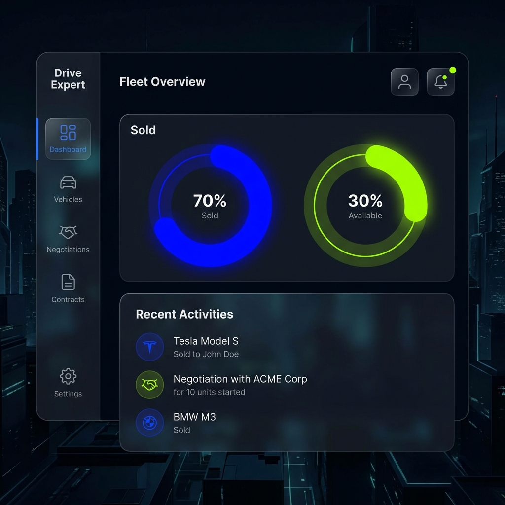
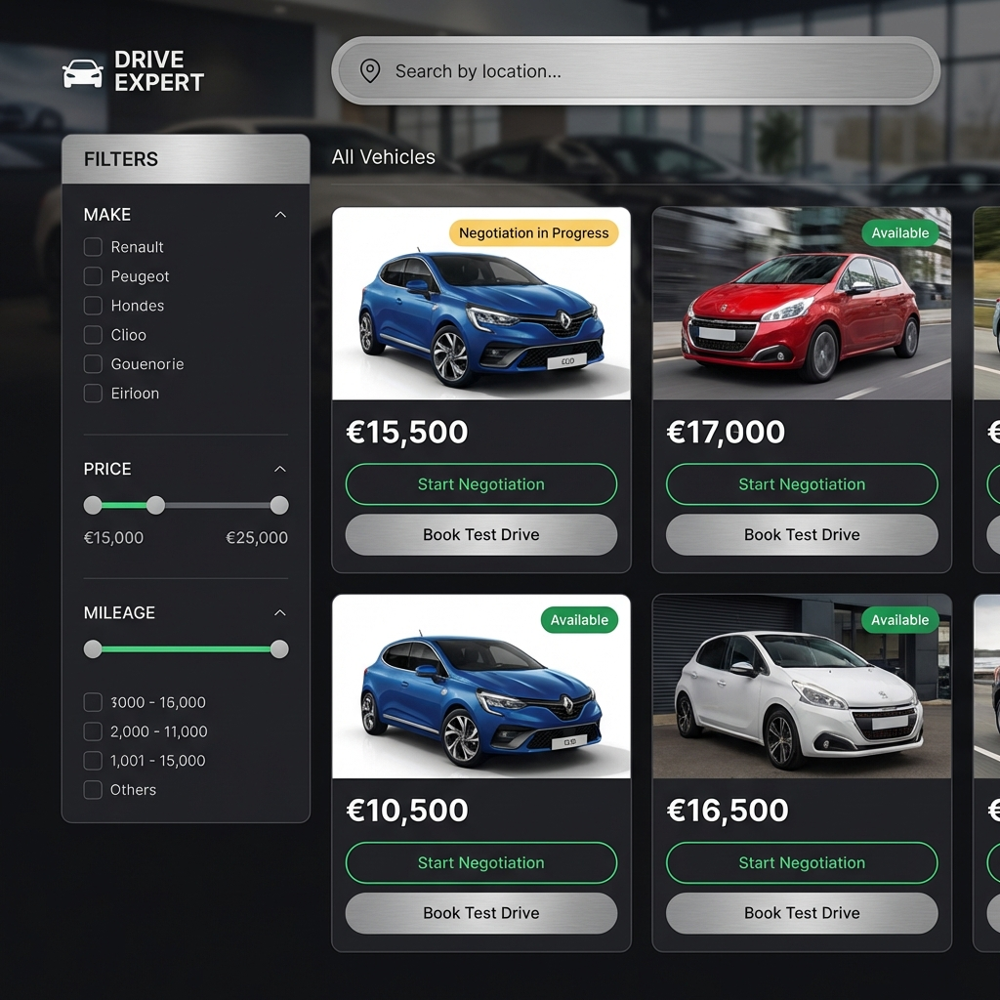
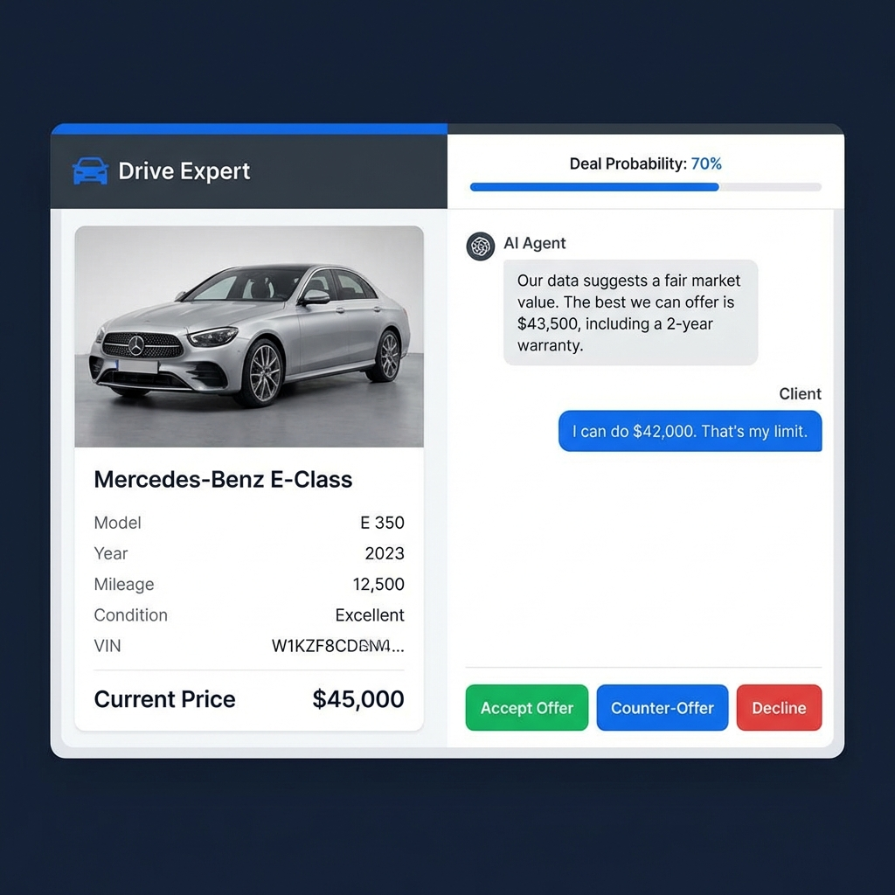
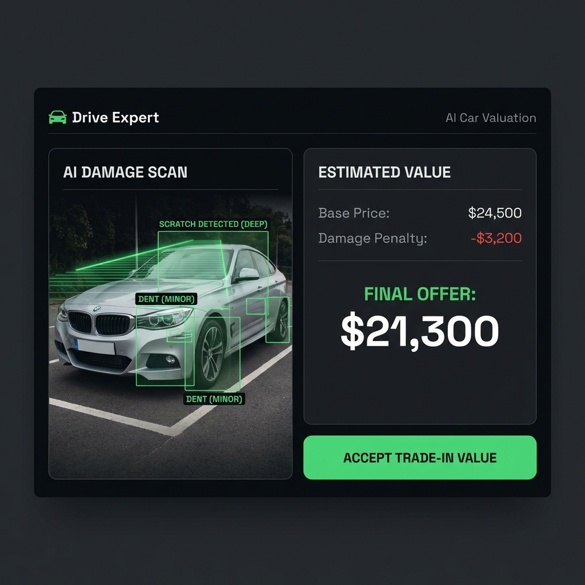
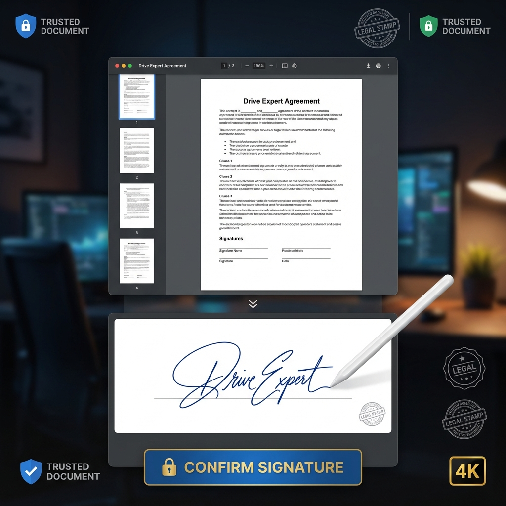
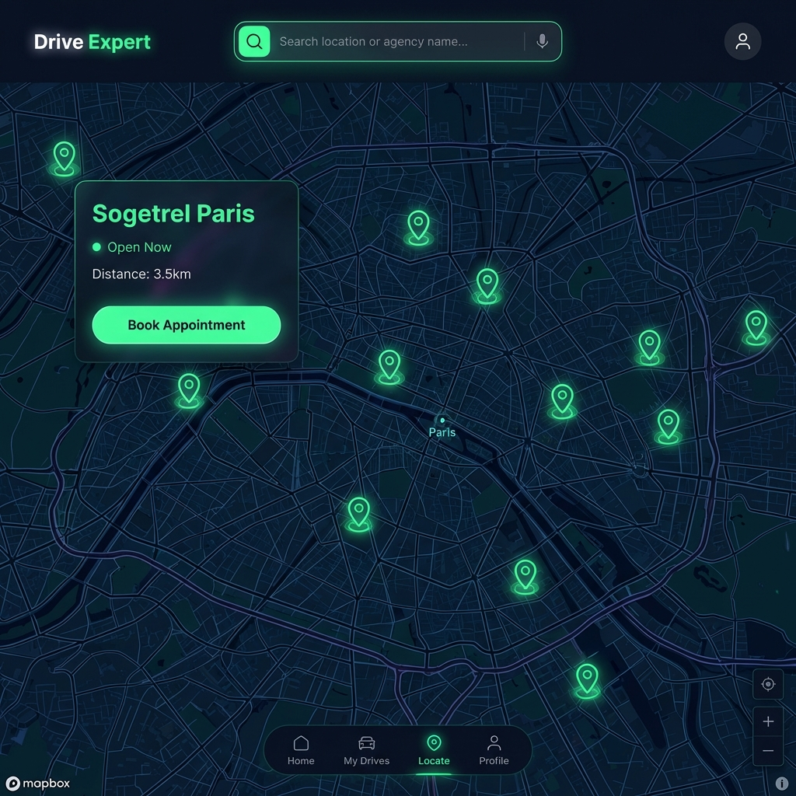
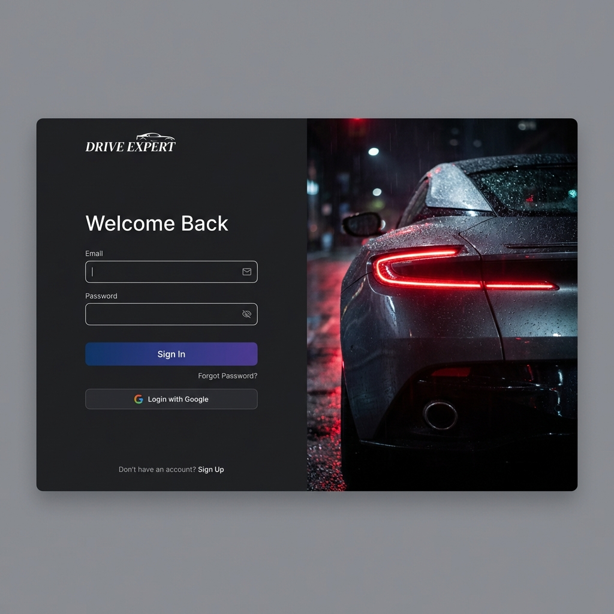

# 🎨 Drive Expert UI Kit & Mockups

> **Design System v1.0** for Frontend Team.
> Based on "Nano Banana Pro" Generations.

---

## 🖼️ High-Fidelity Mockups

### 1. Dashboard (The Command Center)

_Concept: Dark Mode, Glassmorphism, Data-Heavy but Clean._

**Key Elements:**

- **Charts**: Donut charts for "Sold vs Available". Neon colors for high contrast.
- **Sidebar**: Collapsible navigation with clean icons.
- **Activity Feed**: Real-time list of actions (center).

### 2. Vehicle Marketplace (The Catalogue)

_Concept: Premium Automotive, Grid Layout, clear CTAs._

**Key Elements:**

- **Filters**: Left sidebar for Make, Price, Mileage.
- **Cards**: High-quality photo + Bold Price + Status Badge.
- **Actions**: "Start Negotiation" (Primary Green), "Test Drive" (Secondary Grey).

### 3. Negotiation Chat (The Core Feature)

_Concept: Trust, Clarity, Deal-Focus._

**Key Elements:**

- **Split View**: Context (Car) on Left, Chat on Right.
- **Smart Actions**: Buttons "Accept", "Counter", "Decline" to avoid typing.
- **Deal Probability**: Progress bar at the top to gamify the experience.

### 4. AI Car Valuation (The Tech Feature)

_Concept: Futuristic scanning, Data-driven, Trustworthy._

**Key Elements:**

- **Split View**: Visual Scanning (Left) vs Financial Data (Right).
- **Overlays**: Green bounding boxes showing "detected scratches" to prove AI intelligence.
- **Result**: "Final Offer" in large bold white font.

### 5. Contract Signing (The Legal Step)

_Concept: Secure, Professional, binding._

**Key Elements:**

- **Document Viewer**: Realistic PDF render in center.
- **Signature Pad**: Bottom drawer for e-signature.
- **Trust Indicators**: "Legal Stamp" icon and "Secure Connection" badge.

### 6. Agency Locator (The Go-To-Market)

_Concept: Navigational, Dark Map, Neon Pins._

**Key Elements:**

- **Map Style**: Dark Mode (Mapbox/Google Maps Night).
- **Floating Card**: Details of the selected agency overlaid on top.
- **Neon Pins**: Easy to spot locations.

### 7. Login Screen (The First Impression)

_Concept: Cinematic, Luxury, Minimalist form._

**Key Elements:**

- **Imagery**: High-end car detail (Taillight) on the right.
- **Form**: Clean input fields on left.
- **Social Login**: "Login with Google" option.

---

## 🎨 Design Tokens

### Colors

- **Primary (Action)**: `#00FF94` (Neon Green) - Used for "Start Negotiation", "Accept", Success states.
- **Secondary (Brand)**: `#2F80ED` (Electric Blue) - Used for Highlights, Icons, Links.
- **Background**: `#0F172A` (Rich Dark Blue/Black) - Main app background.
- **Surface**: `#1E293B` (Slate Grey) - Card backgrounds, Sidebars.
- **Text**: `#F8FAFC` (White/Off-White) for readability.

### Typography

- **Headings**: _Inter_ or _Outfit_ (Bold, sans-serif).
- **Body**: _Inter_ or _Roboto_ (Regular).
- **Monospace**: _JetBrains Mono_ (for VIN, IDs).

---

**Note to Devs**:
These mockups are "North Stars". You don't need pixel-perfect matching, but try to respect the **Layout** and the **Vibe** (Dark + Neon).
